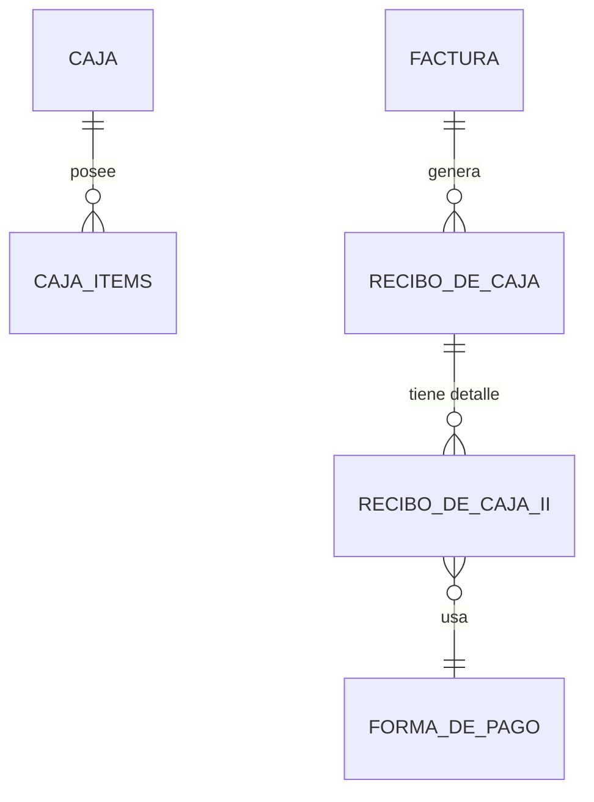

# Documentación Técnica - Cuadre de Caja App

Este proyecto es una herramienta de auditoría financiera diseñada para integrarse con la base de datos **Laureles3** de un sistema SIO (SQL Server). Su objetivo es permitir el cuadre de caja diario de los usuarios, conciliando valores manuales contra los registros del sistema.

---

### 📝 [Ver Historial de Cambios y Versiones (CHANGELOG)](CHANGELOG.md)

---

## Estructura del Proyecto

```text
/ (Raíz del Repositorio / Server)
├── Controllers/        # Lógica de negocio y consultas SQL
├── Routes/            # Definición de Endpoints API
├── bd/                # Configuración de pool de mssql
├── public/            # Frontend (SPA) - Archivos estáticos
│   ├── index.html
│   ├── caja.js
│   ├── styles.css     # Estilos optimizados para impresión térmica
├── .env               # Variables de entorno
├── package.json      # Dependencias y scripts
└── server.js          # Punto de entrada del servidor
```

---

## Arquitectura Non-Intrusiva (Plug & Play)

Una de las principales ventajas de esta solución es su **facilidad de implementación** en cualquier cliente que use SIO, ya que respeta la integridad de la base de datos original:

1.  **Cero Tablas Nuevas:** No se crea ni una sola tabla adicional. La aplicación aprovecha estructuras existentes (como `[Caja Items]`) para almacenar la información de auditoría y gastos.
2.  **Sin Triggers ni Procedimientos:** Toda la lógica de negocio reside en la capa de aplicación (Node.js/Backend). No se instalan triggers ni stored procedures que puedan poner en riesgo la operación crítica del ERP o requerir mantenimiento complejo.
3.  **Compatibilidad Universal:** Al usar consultas SQL estándar sobre el esquema nativo, el software funciona inmediatamente al conectarlo, sin necesidad de ejecutar scripts de migración o alterar el modelo de datos del cliente.

---

## Requisitos Previos

Antes de desplegar el proyecto en un servidor o PC local, asegúrese de cumplir con lo siguiente:

*   **Node.js:** Versión 16.0 o superior (Recomendado: v18 LTS).
*   **Acceso a Red:** La máquina debe tener visibilidad con el servidor de base de datos SQL Server (Puerto TCP 1433 por defecto).
*   **Permisos de Base de Datos:** El usuario SQL configurado en `.env` debe tener permisos de `SELECT`, `INSERT` y `UPDATE` sobre las tablas mencionadas en el modelo de datos.

---

## Configuración del Entorno

El archivo `.env` en la raíz debe contener las siguientes variables para la conexión y configuración del negocio:

- `DB_USER`: Usuario de SQL Server.
- `DB_PASSWORD`: Contraseña del usuario.
- `DB_SERVER`: IP o Hostname de la instancia SQL.
- `DB_DATABASE`: Nombre de la base de datos (Ej: `Laureles3`).
- `PORT`: Puerto del servicio (Por defecto: `3600`).
- `DB_CAJA_ESTADO_ABIERTA`: ID del estado "Abierta" en la tabla Estado (Default: `67`).
- `DB_CAJA_ESTADO_CERRADA`: ID del estado "Cerrada" en la tabla Estado (Default: `68`).
- `DB_CAJA_TIPO_ITEM_EGRESO`: ID del tipo de ítem usado para gastos (Default: `7`).
- `DB_CAJA_TIPO_ITEM_APERTURA`: ID(s) del tipo de ítem usado para la base inicial (separados por comas).
- `DB_CAJA_DOCUMENTO_EMPRESA`: **(Opcional)** NIT o Documento de la empresa para la apertura de cajas.
- `DB_CAJA_TERMINAL_DEFAULT`: **(Opcional)** ID de la terminal física por defecto si no se especifica.

> **Nota de Portabilidad:** Gracias a estas variables, puede conectar esta aplicación a cualquier otra base de datos SIO (ej: `Laureles4`, `OtraEmpresaDB`) simplemente ajustando los credenciales y los IDs de configuración, sin necesidad de modificar el código fuente.

---

## Guía de Implementación en Nuevo Cliente

Para poner en marcha el sistema en una empresa diferente:

1.  **Validar Estructura DB:**
    Asegúrese de que el cliente tenga las tablas estándar de SIO: `Caja`, `Caja Items`, `Factura`, `Recibo de Caja`, `Recibo de CajaII`, `Terminal`, `Estado`.

2.  **Identificar IDs Clave (SQL):**
    Ejecute estas consultas en el SQL Server del cliente para obtener los valores que pondrá en el `.env`:
    *   `SELECT * FROM Estado` -> Para hallar los IDs de "Caja Abierta" y "Caja Cerrada".
    *   `SELECT * FROM Tipo Item Caja` -> Para decidir qué ID usar para "Gastos" y "Base Inicial".
    *   `SELECT * FROM Terminal` -> Para saber el ID de la caja principal (si aplica).

3.  **Configurar `.env`:**
    Cree un archivo `.env` en la raíz del proyecto (basado en el ejemplo proporcionado) y ajuste las siguientes variables críticas para el nuevo cliente:
    *   `DB_SERVER`: La IP del nuevo servidor.
    *   `DB_DATABASE`: El nombre de la base de datos nueva.
    *   `DB_USER` / `DB_PASSWORD`: Credenciales válidas en ese servidor.
    *   `DB_CAJA_DOCUMENTO_EMPRESA`: El NIT de la nueva empresa.
    *   **IDs de Estado/Items:** Actualice `DB_CAJA_ESTADO_ABIERTA`, `DB_CAJA_TIPO_ITEM_EGRESO`, etc., con los valores hallados en el paso 2.

4.  **Ejecución en Producción (Variables de Entorno):**
    Para dejar el servicio corriendo permanentemente (ej: usando PM2 o como Servicio de Windows), no dependa de `npm run dev`.

    **Opción A: Archivo .env (Recomendada)**
    Asegúrese de que el archivo `.env` esté en la misma carpeta que `package.json` y ejecute:
    ```bash
    npm start
    ```

    **Opción B: Inyección de Variables (Sin archivo .env)**
    Si prefiere inyectar las variables directamente desde el sistema operativo o un gestor de procesos (como PM2), configure las variables de entorno en el sistema y lance la aplicación solo apuntando al server:
    ```bash
    # Ejemplo Linux/Mac
    PORT=8080 DB_SERVER=192.168.1.50 node Server/server.js
    
    # Ejemplo Windows Powershell
    $env:PORT="8080"; node Server/server.js
    ```

    **Opción C: Servicio de Windows (NSSM - Recomendada)**
    Para que la aplicación inicie con Windows automáticamente:
    1.  Descargue [NSSM](https://nssm.cc/).
    2.  Ejecute: `nssm install CuadreCajaService`.
    3.  **Pestaña Application:**
        *   Path: Ruta a `node.exe` (ej: `C:\Program Files\nodejs\node.exe`).
        *   Startup directory: La carpeta raíz del proyecto.
        *   Arguments: `Server/server.js`.
    4.  **Pestaña Environment:**
        Puede pegar aquí el contenido del archivo `.env` o definir las variables línea por línea:
        ```text
        PORT=3600
        DB_SERVER=192.168.1.10
        DB_DATABASE=Laureles3
        ...
        ```
    5.  Clic en "Install service". ¡Listo!

---

## Gestión de Gastos (Egresos)

El sistema permite registrar salidas de dinero durante el turno para justificar descuadres en el efectivo final.

1.  **Registro:** Se realiza mediante el botón "Gasto", disponible únicamente cuando la caja está abierta.
2.  **Cálculo:**
    *   Los gastos **NO** afectan la columna de "Ventas en Efectivo" (esta solo refleja ingresos).
    *   Se restan en el cálculo final del cuadre: `(Base + Ventas Totales) - Gastos = Total Esperado`.
3.  **Gestión y Corrección:** Desde el modal de cierre, el usuario puede visualizar la lista de gastos registrados y **eliminar** cualquiera que haya sido ingresado por error antes de cerrar la caja.
4.  **Visualización:** Aparecen como un valor negativo antes del total final en los informes y tickets.

---

## Informes y Tickets

-   **Ticket de Cierre:** Optimizado para impresoras térmicas con **fuentes de alto contraste (Negrita/Negro Puro)** y tipografía monoespaciada para asegurar legibilidad perfecta.
-   **Informe en Pantalla:** Modal que permite verificar la "Base Inicial" y visualizar todas las facturas del turno.
-   **Exportación a Excel:** Genera un archivo `.csv` compatible con Excel con el detalle completo de movimientos.

---

## Lógica de Conciliación y Particularidades SQL

El backend implementa una lógica específica para adaptarse al funcionamiento de la base de datos SIO instalada:

### 1. Modelo Centrado en Recibos
En esta instalación, la tabla `[dbo].[Factura Forma de Pago]` **no se utiliza**. Todos los pagos (contado y crédito) se procesan a través de las tablas de Recibo.
*   Por esto, la consulta principal une `[dbo].[Recibo de Caja]` y `[dbo].[Recibo de CajaII]` para determinar el dinero real recaudado.

### 2. Conciliación de Totales (Lógica de Cuadre - Solo Efectivo)
El sistema calcula el dinero físico que **debería** haber en el cajón. Los medios electrónicos (Débito, Transferencia) se muestran para auditoría pero **NO** suman al saldo de caja.

> **Reportado (Usuario)** = Dinero físico contado (Solo Billetes y Monedas).
> 
> **Esperado (Sistema)** = `(Base Inicial + Ventas en Efectivo) - Gastos (Egresos)`

*   **Enfoque en Efectivo:** El objetivo es cuadrar el dinero real. Si falta dinero en Nequi o Bancolombia, eso se revisa en la fila correspondiente, pero no genera un "faltante de caja" físico.
*   **Ventas en Efectivo:** Solo se suman las facturas pagadas con dinero contante y sonante.
*   **Gastos (Egresos):** Se restan del total de efectivo disponible.
*   **Sin duplicidad de Base:** El usuario reporta todo el dinero que tiene en la mano (incluyendo la base). El sistema compara ese total contra la meta calculada.

### 3. Compatibilidad Legacy (SQL Server 2014)
El sistema ha sido adaptado para funcionar en versiones antiguas de SQL Server que no soportan funciones modernas:
*   **Concatenación de Texto:** Se utiliza la técnica `FOR XML PATH` en lugar de `STRING_AGG` para listar los medios de pago.

---

## Modelo de Datos

A continuación se describen las tablas principales involucradas:

### Tablas de la Aplicación
*   **`[dbo].[Caja]`**: Registro de sesiones/turnos.
*   **`[dbo].[Caja Items]`**: Registro de movimientos manuales (Base inicial y Gastos).

### Tablas del Sistema SIO (Fuente de la Verdad)
*   **`[dbo].[Recibo de Caja]`**: Conector entre la factura y el pago.
*   **`[dbo].[Recibo de CajaII]`**: Almacena el valor monetario y la forma de pago real.
*   **`[dbo].[Factura]`**: Referencia documental (Número, Cliente), no utilizada para sumar totales financieros.

---

## Mapas de Relaciones



---

## Despliegue y API

### Ejecución
```bash
npm run dev
```

### Endpoints Principales
| Método | Endpoint | Descripción |
| :--- | :--- | :--- |
| `GET` | `/api/cajas` | Listado histórico. |
| `POST` | `/api/cajas` | Apertura de turno. |
| `GET` | `/api/cajas/:id/movimientos` | Resumen financiero. |
| `POST` | `/api/cajas/:id/egreso` | Registro de gastos. |
| `PUT` | `/api/cajas/:id/cerrar` | Cierre de turno. |

---

## Notas de Mantenimiento

-   **Sincronización de Tiempo:** Para evitar desfases por la configuración regional de la Base de Datos, el sistema utiliza la hora del servidor de aplicación (Node.js) para todos los registros de tiempo, garantizando consistencia absoluta con la hora local del usuario.
-   **Visualización:** Se ha simplificado la interfaz eliminando los segundos de todos los sellos de tiempo, facilitando una lectura rápida de los turnos.
-   **Base de Datos:** Se ajustó el código para tolerar un error tipográfico histórico en la columna `[Hora Inico Caja]`.
-   **Interfaz:** El campo de "Base" se implementó como un elemento de texto (`span`) en lugar de input para asegurar que las cifras grandes se muestren completas.

---

## Consultas Útiles (Troubleshooting)

Para corregir valores en base de datos, es necesario identificar el ID del Recibo, ya que es allí donde reside el dinero. Use esta consulta:

```sql
SELECT 
    f.[No Factura], 
    f.[Documento Responsable] AS Cliente,
    rc.[Id Recibo de Caja],       -- ID REQUERIDO PARA EDICIÓN
    rcii.[Valor Recibo de CajaII] AS ValorPagado
FROM [dbo].[Factura] f
JOIN [dbo].[Recibo de Caja] rc ON f.[Id Factura] = rc.[Id Factura]
JOIN [dbo].[Recibo de CajaII] rcii ON rc.[Id Recibo de Caja] = rcii.[Id Recibo de Caja]
WHERE f.[No Factura] = 'NUMERO_FACTURA';
```


